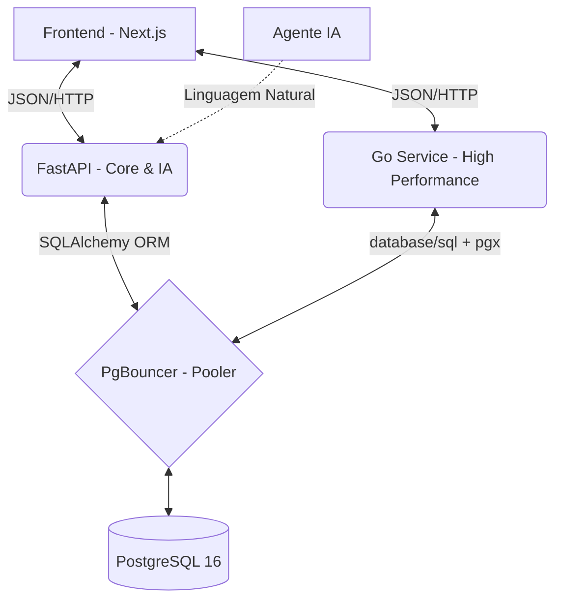

# 💲PayWinApp

> Gerenciador financeiro inteligente com arquitetura poliglota (Next.js + FastAPI + Go) focado em acessibilidade, LGPD e educação financeira pessoal.


---

## ✨ Visão Geral

O **PayWinApp** nasceu com o objetivo de reduzir a barreira de entrada na organização financeira pessoal, unindo inteligência artificial, acessibilidade e uma arquitetura poliglota moderna.  
Mais do que um simples gerenciador de gastos, o projeto atua como um **educador financeiro**, ajudando o usuário a entender seu comportamento de consumo e a tomar decisões mais conscientes.

A aplicação demonstra como orquestrar múltiplos ecossistemas (Node, Python e Go) em harmonia, priorizando:

- Experiência do usuário (UX)
- Conformidade com a LGPD (Privacy by Design)
- Alta performance no processamento de dados
- Manutenibilidade e escalabilidade da arquitetura

---

## 📚 Índice

- [Visão Geral](#-visão-geral)
- [Tecnologias Principais](#-tecnologias-principais)
- [Arquitetura](#-arquitetura)
  - [Visão de Arquitetura](#-visão-de-arquitetura)
  - [Fluxo de Dados](#-fluxo-de-dados)
- [Quick Start (Docker)](#-quick-start-docker)
- [Persistência e Resiliência](#-persistência-e-resiliência)
- [Estrutura do Projeto](#-estrutura-do-projeto)
- [Boas Práticas e Convenções](#-boas-práticas-e-convenções)
- [Roadmap](#-roadmap)
- [Contribuição](#-contribuição)
- [Autor](#-autor)
- [Licença](#-licença)

---

## 🧰 Tecnologias Principais

- **Frontend:** Next.js 14, TypeScript, Tailwind CSS, shadcn/ui
- **Backend Core & IA:** FastAPI (Python), Pydantic, integração com LLM
- **Serviço de Alta Performance:** Go, Chi, database/sql, pgx
- **Banco de Dados:** PostgreSQL 16, SQLAlchemy, PgBouncer
- **Infraestrutura:** Docker, Docker Compose, Dev Containers, VS Code

---

## 🧩 Arquitetura

### Visão de Arquitetura

A arquitetura foi desenhada para extrair o melhor de cada stack, mantendo os serviços desacoplados e escaláveis:

- **Frontend (Next.js 14 + TypeScript)**  
  Interface focada em acessibilidade (WCAG 2.1 AA) e responsividade, abrigando o chat com o Agente Financeiro e o painel de controle financeiro.

- **Backend Core & IA (FastAPI)**  
  O “cérebro” da operação: regras de negócio centrais, orquestração de fluxos, validações e comunicação com o modelo de linguagem para interpretação de linguagem natural.

- **Serviço de Alta Performance (Go + Chi)**  
  O “motor pesado”: rotas de alta concorrência, processamento em lote, agregações e relatórios com foco em baixa latência.

- **Persistência (PostgreSQL 16 + PgBouncer)**  
  O “cofre”: armazenamento relacional, com pool de conexões via PgBouncer para suportar picos de acesso.

### 🔄 Fluxo de Dados



##⚡ Quick Start (Docker)
Todo o ecossistema — Frontend, APIs, Banco de Dados e Pool de Conexões — é orquestrado via Docker Compose, com suporte a Dev Containers para um ambiente reprodutível.

Pré‑requisitos
Docker e Docker Compose instalados

VS Code (opcional, mas recomendado)

Extensão “Dev Containers” (recomendado)
# 1. Clone o repositório e acesse o diretório
git clone https://github.com/Gustavocferreira/Projeto-paywinapp.git
cd Projeto-paywinapp

# 2. Suba a infraestrutura completa
docker-compose up -d --build
Serviços padrão:

Frontend: http://localhost:3000

API Python (FastAPI): http://localhost:8000

API Go: http://localhost:8080

Banco de Dados: localhost:5432

**💾 Persistência e Resiliência
Os dados são tratados como críticos.
A persistência é garantida via volumes Docker (paywin_postgres_data), sobrevivendo a reinicializações e rebuilds do ambiente.

Backup
Windows (PowerShell):
.\backup.ps1

Unix-like:
docker exec paywin_postgres pg_dump -U paywinuser paywinapp > backup.sql

Windows (PowerShell):
.\restore-backup.ps1 -BackupFile "backup.zip"

Unix-like:
docker exec -i paywin_postgres psql -U paywinuser paywinapp < backup.sql

***📂 Estrutura do Projeto:
```
.
├── frontend/               # O Rosto (Next.js App)
├── services/
│   ├── python-api/         # O Cérebro (FastAPI, IA, Regras de Negócio)
│   └── go-api/             # O Motor (Go, Rotas Críticas e Relatórios)
├── db/                     # A Fundação (Configs, Seeds, Migrations)
├── docs/                   # A Bússola (Documentação técnica e arquitetural)
├── .devcontainer/          # O Molde (Setup reprodutível para VS Code)
└── docker-compose.yml      # O Maestro (Orquestração dos serviços)
```

**🧠 Boas Práticas e Convenções
Privacy by Design:
Modelagem de banco e fluxos de dados em conformidade com a LGPD desde a concepção.

Acessibilidade First:
Componentes desenvolvidos seguindo as diretrizes WCAG 2.1 AA, com foco em navegação por teclado e leitores de tela.

Separação de Responsabilidades:
Processamento intensivo isolado no serviço em Go; a API em Python foca em IA, validações e regras de negócio.

Infraestrutura Imutável:
Uso de Dev Containers e Docker para eliminar o “na minha máquina funciona” e garantir ambientes consistentes.

*🚀 Roadmap
 Modelagem de dados e arquitetura base (Sprint 1)

 Dockerização e configuração de Dev Containers (Sprint 1)

 CRUD de transações, metas e Dashboard básico (Sprint 2)

 Integração de LLM e Chat UI para o Agente Financeiro (Sprint 3)

 Auditoria de acessibilidade, otimização de performance e Deploy (Sprint 4)

Em breve será adicionado um CONTRIBUTING.md com mais detalhes de fluxo de contribuição.

**🤝 Contribuição
```Contribuições são muito bem-vindas!
Algumas formas de contribuir:

Abrir issues com bugs, dúvidas ou sugestões

Enviar PRs com melhorias de código, testes ou documentação

Sugerir métricas, relatórios ou melhorias de UX/IA

Antes de abrir um PR, considere:

Criar uma issue descrevendo a mudança proposta

Seguir o padrão de código já adotado nos serviços

Adicionar testes (quando aplicável) e atualizar a documentação
Em breve será adicionado um CONTRIBUTING.md com mais detalhes de fluxo de contribuição.
```
--

*👤 Autor
Gustavo Costa Ferreira
Full-stack Developer & DevOps no Instituto do Legislativo Paulista (Alesp).
Bacharel em TI pela Univesp.

Focado em sistemas escaláveis, arquitetura limpa e automação de ambientes.

*“A tecnologia deve se adaptar ao usuário, e não o contrário.
Um bom código constrói pontes, não barreiras.”*
